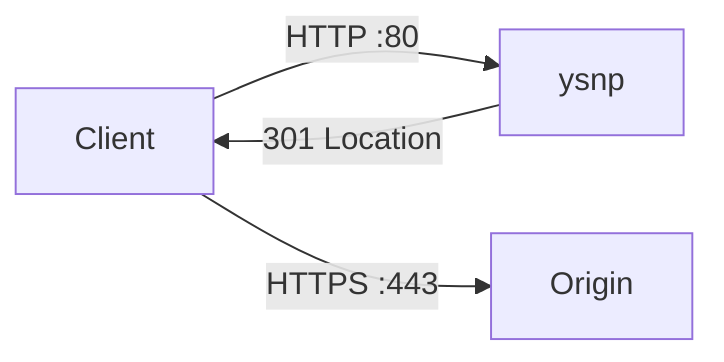

# ysnp

[](https://github.com/virtualpeter/ysnp/actions/workflows/ci.yml)
[](go.mod)
[](LICENSE)

A small HTTP redirector. Sit it on port 80 and send every request to the same host and path over HTTPS.

The destination hostname must be listed in `-target_host` and/or `-allowed_hosts`. Unknown hosts get `400` and no `Location`.

```
http://example.com/foo?q=1  →  301  →  https://example.com/foo?q=1
```

Request logs go to stdout as JSON. No dependencies beyond the Go standard library.



## Quick start

```bash
go run ./cmd/ysnp -allowed_hosts localhost
```

```bash
curl -sI http://localhost:8080/testURI
# HTTP/1.1 301 Moved Permanently
# Location: https://localhost/testURI
```

On port 80 with Docker Compose:

```bash
make compose-up
```

## Install

**From source**

```bash
go build -o bin/ysnp ./cmd/ysnp
```

**Docker image**

```bash
make docker
docker run --rm -p 80:8080 -e TARGET_HOST=www.example.com docker.io/virtualpete/ysnp:latest
```

Override image naming with `REGISTRY` and `DOCKER_ORG` (defaults: `docker.io` / `virtualpete`).

## Configuration

Flags win when set. Otherwise the matching environment variable is used.

Startup fails unless `-target_host` or `-allowed_hosts` is set. Host matching is exact and case-insensitive (`example.com.evil.org` is not `example.com`).

| Flag | Env | Default | Description |
| --- | --- | --- | --- |
| `-listen` | `LISTEN` or `PORT` | `:8080` | Address to listen on. `PORT=8080` becomes `:8080`. |
| `-target_proto` | `TARGET_PROTO` | `https` | Scheme for the Location URL (`https` or `http`). |
| `-target_host` | `TARGET_HOST` | _(none)_ | Force this hostname in Location. Implicitly allow-listed. |
| `-allowed_hosts` | `ALLOWED_HOSTS` | _(none)_ | Comma-separated hostnames permitted when `-target_host` is empty. |
| `-target_port` | `TARGET_PORT` | _(none)_ | Explicit port in the Location URL. |
| `-target_path` | `TARGET_PATH` | request path | Hardcoded path. Empty keeps the request path. |
| `-blockquery` | `BLOCKQUERY` | `false` | Drop query parameters from the redirect. |
| `-status` | `STATUS` | `301` | Redirect status: `301`, `302`, `307`, or `308`. |
| `-log` | `LOG` | `json,info` | Comma-separated log options. |
| `-config` | `CONFIG` | _(none)_ | Optional JSON file mapping URI prefixes to overrides. |
| `-version` | | | Print the git-tag version and exit. |

### Log flags

Combine any of: `debug`, `info`, `warn`, `error`, `fatal`, `json`, `color`, `nocolor`.

```bash
./bin/ysnp -log debug,json
./bin/ysnp -log warn,nocolor
```

### Examples

Force every request onto a canonical host:

```bash
./bin/ysnp -target_host www.example.com
```

Redirect to HTTPS on 8443 and strip query strings:

```bash
./bin/ysnp -allowed_hosts example.com -target_port 8443 -blockquery
```

Same thing in Compose:

```yaml
services:
  ysnp:
    image: docker.io/virtualpete/ysnp:latest
    ports:
      - "80:8080"
    environment:
      TARGET_HOST: www.example.com
      BLOCKQUERY: "true"
      LOG: json,info
```

### Route map

An optional JSON object keyed by URI path prefix. Longest prefix wins. `/api` matches `/api` and `/api/v1`, but not `/apiv2`. `/` is a catch-all. Omitted fields inherit the process-wide flags.

```bash
./bin/ysnp -target_host www.example.com -config ysnp.example.json
```

```json
{
  "/old": {
    "target_path": "/new",
    "target_port": "8443",
    "blockquery": true,
    "status": 302,
    "log": "debug"
  },
  "/api/": {
    "blockquery": true,
    "status": 308
  }
}
```

Per-route `log` uses the same tokens as `-log`, plus `off` to skip the access line. `json` / `color` / `nocolor` on a route are ignored; format is process-global.

In Docker, mount the file and set `CONFIG`:

```bash
docker run --rm -p 80:8080 \
  -v "$PWD/ysnp.example.json:/map.json:ro" \
  -e CONFIG=/map.json \
  -e TARGET_HOST=www.example.com \
  docker.io/virtualpete/ysnp:latest
```

## Development

```bash
make build    # bin/ysnp
make test     # go test ./...
make vet      # go vet ./...
make run      # go run ./cmd/ysnp
make docker   # build and tag the image
```

```
cmd/ysnp/            command entrypoint
internal/server/     redirect handler and request logger
```

## License

[MIT](LICENSE)
